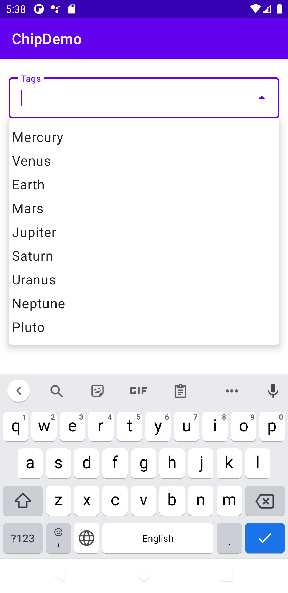
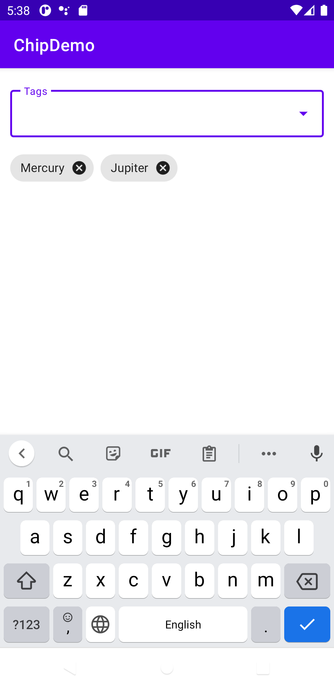
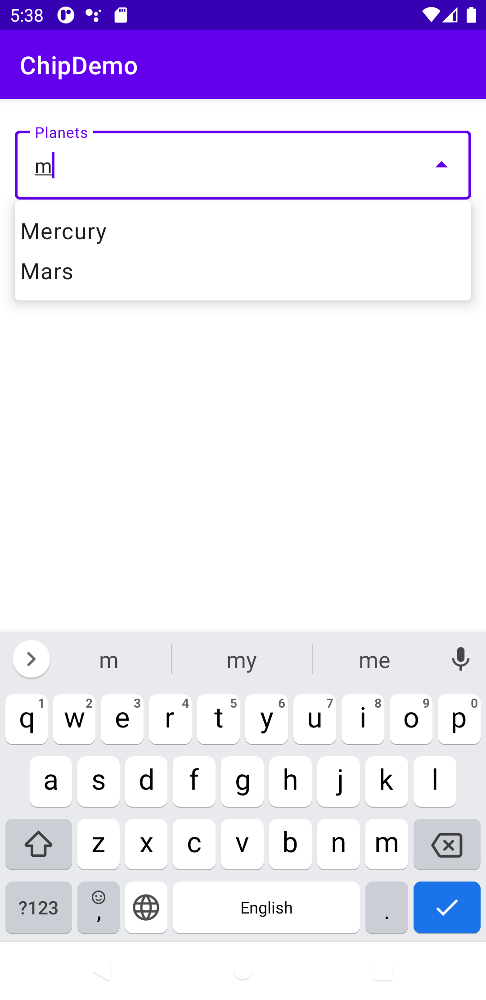
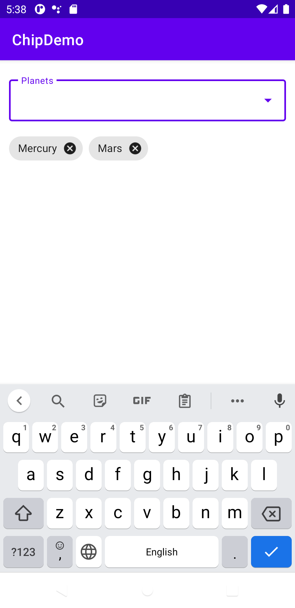
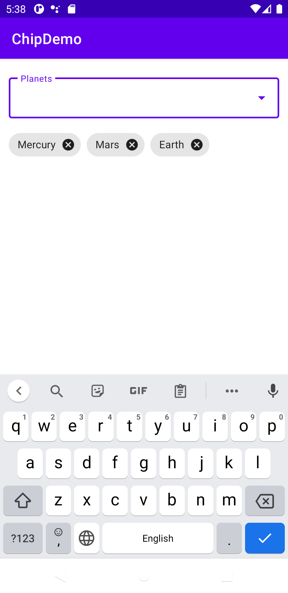

# Chip Demo

Display items in AutoCompleteTextView and show selected items as Chips.

Companion project for [Display Item Selected from AutoCompleteTextView in Chip](https://pcsalt.com/android/display-item-selected-from-autocompletetextview-in-chip-android/).

## Tech Stack

- Kotlin
- View Binding
- Material 3
- Min SDK 34 / Target SDK 36

## Video Tutorial

[YouTube Tutorial](https://youtu.be/P_VzyEfpZTc)

## Screenshots

    
