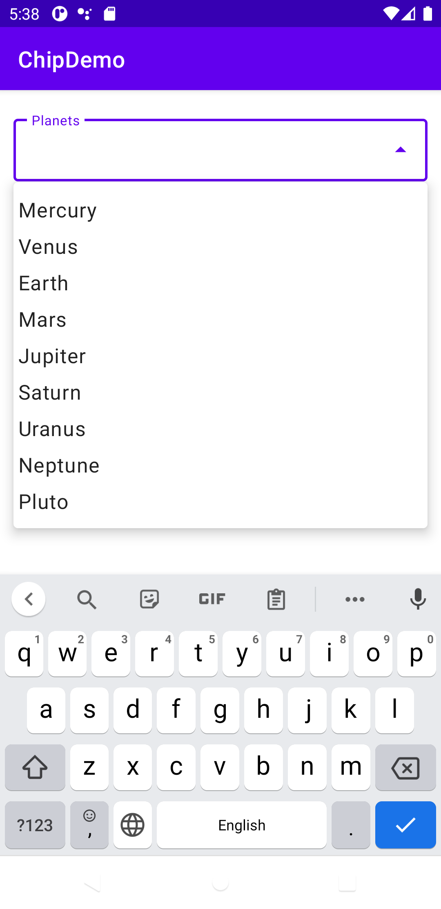
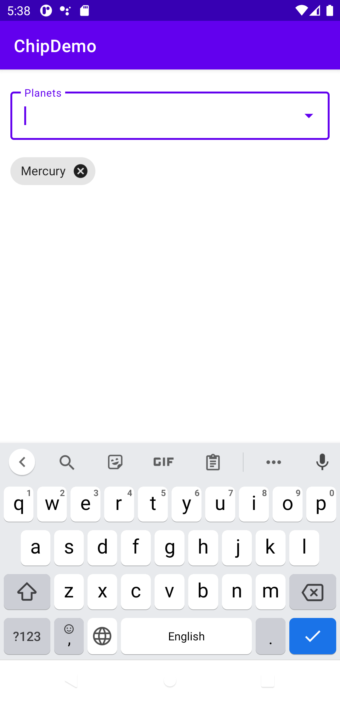
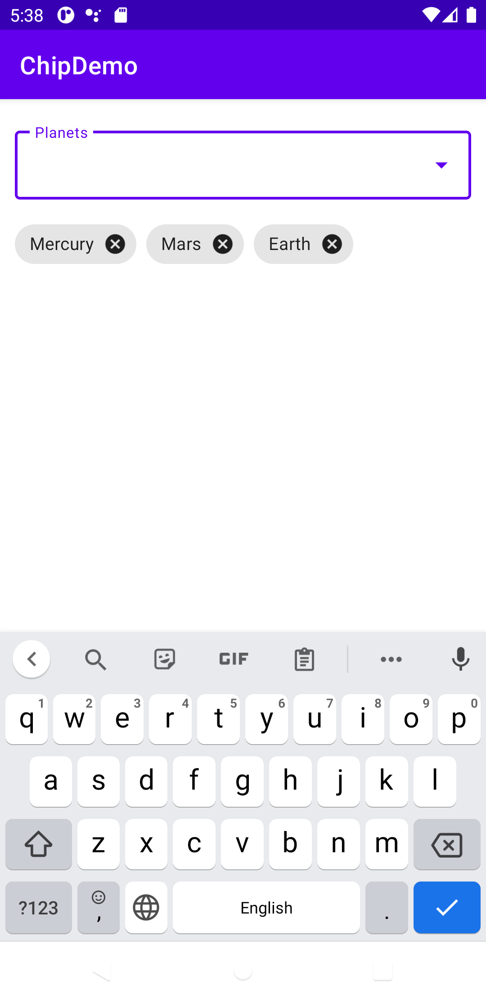

# ChipDemo
### Display items in AutoCompleteTextView and show selected items in Chip

### Screenshots
     

Follow PCSalt on
Facebook: https://fb.me/PCSalt
Instagram: https://www.instagram.com/pcsalt
Twitter: https://www.twitter.com/pcsalt
